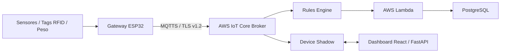

# SmartLab Inventory - Sistema Inteligente de Gestão de Laboratórios


O **SmartLab Inventory** é uma solução IoT end-to-end projetada para automatizar o rastreamento, controle de empréstimos de ferramentas e monitoramento de estoque de componentes em tempo real dentro de ambientes de ensino e pesquisa.

---

## 💻 Problema vs Solução

* **Problema:** Perda constante de ferramentas, descontrole em estoque de insumos e falhas em registros manuais causam atrasos e custos desnecessários em laboratórios.
* **Solução:** Uma rede de gateways ESP32 equipados com leitores RFID, sensores magnéticos e células de carga acoplados ao AWS IoT Core e dashboards Web para gestão automatizada.

---

## 🏗️ Arquitetura do Sistema



---

## 📡 Tópicos MQTT Principais

| Tópico | Descrição | QoS |
| :--- | :--- | :---: |
| `smartlab/armario1/rfid/evento` | Eventos de checkout/checkin de ferramentas por RFID | 1 |
| `smartlab/armario1/porta/status` | Estado físico da porta (Aberta/Fechada) | 1 |
| `smartlab/prateleira1/telemetria` | Leitura contínua da massa (gramas) na prateleira | 0 |
| `smartlab/armario1/trava/cmd` | Comando remoto para liberação da trava magnética | 1 |

---

## Vídeo de Demonstração


https://github.com/user-attachments/assets/99860a60-9d05-4e0e-996d-2e3d4566f272


---

## 🚀 Como Executar a Simulação

### 1. Simulação no Wokwi Web (Edge / ESP32)
1. Acesse o [Wokwi](https://wokwi.com).
2. Carregue o arquivo `code/diagram.json` e o `code/sketch.ino`.
3. Adicione a biblioteca `PubSubClient` em `libraries.txt`.
4. Inicie a simulação.

### 2. Simulação em Python (Local)
```bash
# 1. Clonar o repositório
git clone https://github.com/joserafaelrebelo/atividade_iot2.git
cd atividade_iot2

# 2. Instalar dependências
pip install -r requirements.txt

# 3. Rodar o Subscriber (Backend)
python src/subscriber_backend.py

# 4. Rodar o Publisher (ESP32 Simulado)
python src/publisher_esp32.py
```
---
## 👥 Autores

- Eduardo Dias Peixoto  
- José Rafael Rebêlo Teles  
- Luan de Paula Mota  
- Renan Godoi Sant’ana

